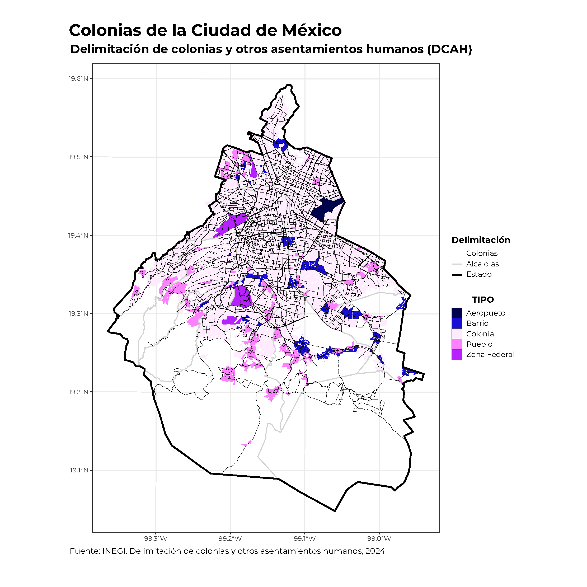

```{=html}
<style type="text/css">
body {
text-align: justify;
font-style: normal;
font-family: "Montserrat";
font-size: 12px
}
h1.title {
  font-size: 40px;
  color: #000D3B;
}
h1 {
  color: #B6854D;
}
h2 {
  color: #172984;
}
h3 {
  color: #172984;
}
</style>
```

```{=html}
<style>
.nav>li>a {
    position: relative;
    display: block;
    padding: 10px 15px;
    color: #1C3BA4
}
.nav-pills>li.active>a, .nav-pills>li.active>a:hover, .nav-pills>li>a:focus {
    color: #ffffff;
    background-color: #09C2BC
}
</style>
```

```{=html}
<style>
.tile1-text {
    position: relative;
    display: block;
    padding: 10px 15px;
    color: #0A6A87;
    list-style: none;
}
.top1-tiles a:nth-of-type(1):hover, .top-tiles1 a:nth-of-type(1):focus{
    color: #ffffff;
    background: #0A6A87
}
</style>
```

```{=html}
<style>
.tile2-text {
    position: relative;
    display: block;
    padding: 10px 15px;
    color: #0A6CC8;
    list-style: none;
}
.top2-tiles a:nth-of-type(1):hover, .top2-tiles a:nth-of-type(1):focus{
    color: #ffffff;
    background: #0A6CC8
}
</style>
```

```{=html}
<style>
.math {
  font-size: 15px;
  color: #1e42ab;
}
</style>
```

```{r setup, include=FALSE}
knitr::opts_chunk$set(echo = TRUE, message = FALSE, warning = FALSE, cache = TRUE, 
                      cache.lazy = FALSE, class.source = "fold-show")
knitr::opts_knit$set(root.dir = here::here())
setwd(here::here())
```

```{r,echo=FALSE, eval=FALSE}
rm(list = ls())
```

```{r, echo = FALSE, results=FALSE}
# Paquetes que se usaron en el documento 
require(dplyr)          #A Grammar of Data Manipulation 
require(RColorBrewer)
require(knitr)
require(kableExtra)
require(openxlsx)
require(readxl)
require(ggplot)
require(ggspatial)
require(rgdal)          #Para importar shapefiles. 
require(sp)             # Classes and Methos for Spatial Data
library(spdep)    # Índice de Moran 
require(spdplyr)        #Data manipulation verbs for the sptial classes
require(ggpubr)
require(unikn)
```

```{r, echo = FALSE, results=FALSE}
# Se descargan las fuentes de la google fonts
require(showtext)
library(extrafont)
# activar showtext
windowsFonts()
```

## Objetivo  

La **Delimitación de Colonias y otros Asentamientos Humanos (`DCAH`)** constituye una iniciativa del Instituto Nacional de Estadística y Geografía (`INEGI`) que tiene como propósito esencial la generación y mantenimiento de un sistema integral de información geográfica sobre los asentamientos humanos en el territorio mexicano. Este proyecto se desarrolló mediante un marco de colaboración estratégica con las autoridades municipales, quienes desempeñan un papel crucial en la delimitación precisa de estos espacios territoriales.

La implementación del `DCAH` se sustenta en cuatro pilares fundamentales que garantizan su efectividad y relevancia institucional. 

1. **Generación de información geográfica precisa:** El programa se centra en la generación de información geográfica de alta precisión, estableciendo un riguroso sistema de datos espaciales que refleja fielmente la realidad territorial de los asentamientos humanos en México. Este compromiso con la exactitud y la calidad de los datos representa la base sobre la cual se construyen todas las demás funciones del programa.

2. **Análisis y la toma de decisiones:** Capacidad para facilitar procesos de análisis y toma de decisiones en múltiples ámbitos. La información generada por el DCAH se ha convertido en un recurso indispensable para la planificación urbana estratégica, la optimización en la gestión de servicios públicos, el desarrollo de investigaciones sociodemográficas y la formulación de políticas públicas basadas en evidencia. Esta versatilidad en su aplicación demuestra el valor multidimensional del programa.

3. **Promover la colaboración interinstitucional:** Enfoque en la promoción de la colaboración interinstitucional. El INEGI ha establecido mecanismos efectivos de cooperación con las autoridades municipales, creando sinergias que aseguran tanto la calidad como la actualización continua de la información recopilada. Esta colaboración representa un modelo ejemplar de coordinación entre diferentes niveles de gobierno para el beneficio público.

4. **Poner a disposición de la sociedad información relevante:** La democratización del acceso a la información. El INEGI ha implementado una política de transparencia y accesibilidad, poniendo a disposición del público general los datos del DCAH a través de su plataforma digital. Esta iniciativa no solo cumple con los principios de gobierno abierto, sino que también facilita el acceso a información valiosa para investigadores, planificadores urbanos y ciudadanos interesados. 

## Proposito   

Proporcionar a las **Unidades de Estado (UE)** y a la sociedad en general un insumo que permita el análisis y estudios referidos a esta delimitación de colonias y otros asentamientos humanos, en temas geográficos, sociales, demográficos, económicos, culturales, históricos, políticos, entre otros.

Se encuentran en formatos digitales, cabe aclarar que **aún no se cuenta con la cobertura a nivel nacional**, pero se cuenta con Delimitaciones de colonias y otros asentamientos humanos y conjuntos de datos vectoriales con los que se tiene el aval del Ayuntamiento municipal.

Los archivos vectoriales se encuentran disponibles en formato Shape (`.shp`), los cuales pueden ser incorporados en sistemas de información geográfica (`SIG`). Mismo que se encuentran disponibles en la página oficial del [INEGI](https://www.inegi.org.mx/programas/dcah/#descargas)


> **Asentamiento humano:** Es el establecimiento de un conglomerado demográfico, con el conjunto de sus sistemas de convivencia, en un área físicamente localizada considerando dentro de la misma los elementos naturales y las obras materiales que lo integran. También es un componente de referencia del **domicilio geográfico**.   

**Delimitación de los asentamientos humanos**   

La delimitación o actualización de los asentamientos humanos conforman a las localidades amanzanadas de la siguiente manera:    

- Localidades con 50 000 habitantes o más y ciudades capitales.   
- Conglomerados de localidades contiguas.  
- Localidades cabeceras municipales.   
- El resto de las localidades urbanas.   
- El resto de las localidades rurales amanzanadas.   


### Integración del conjunto de datos vectoriales de la capa de asentamientos humanos  

```{r, echo = FALSE}
require(gt)
require(openxlsx)
tabla <- read.xlsx("Bases/Estructura.xlsx")

tabla %>% 
 gt() %>%
  tab_header(title = "Conjunto de datos vectoriales de la capa de asentamientos humanos",
             subtitle = "Insituto Nacional de Estadística y Geografía") %>%
   tab_footnote(footnote = "Fuente: INEGI. Delimitación de colonias y otros asentamientos humanos, 2024") %>%
     tab_options(heading.title.font.size = 14, 
                 heading.subtitle.font.size = 12,
                 table.font.names = "Century Gothic",
                 table.font.size = 10,
                 data_row.padding = px(1)) %>%
      tab_style(style = list(cell_text(align = "left",
                                       weight = 'bold')),
                locations = list(cells_title(groups = c("title")))) %>%
       tab_style(style = list(cell_text(align = "left")),
                 locations = list(cells_title(groups = c("subtitle")))) %>%
        cols_width(starts_with("Contenido") ~ px(400),
                   starts_with("Descripción") ~ px(200),
                   everything() ~ px(80)) %>%
         as_raw_html() 
```


## Shapefile

La función `readOGR` del paquete `rgdal`, extrae automáticamente la información utilizada por otros paquetes `SIG` de código abierto como QGIS y permite a R manejar una gama más amplia de formatos de datos espaciales. Esta función lee datos `OGR` y datos vectoriales, pero solamente permite manejar capas con características geométricas (no mezcla puntos, líneas o polígonos en una sola capa) y a su vez establecerá un sistema de referencia espacial si la capa tiene dichos metadatos.\
Para leer un archivo `shapefile`, se establecen los siguientes argumentos, como `dsn`, en donde se indica el directorio que contiene los shapes y `layer` que es el nombre explícito de la capa a trabajar y dichas capas deben de ir sin la extensión `.shp`.

A continuación, se lee el archivo .shp que contiene de manera integrada la división de el área geoestadística de asentamientos `as`.

```{r,results=FALSE, class.source = "fold-show"}
shape_asentamientos <- readOGR(dsn ="D:/Colonias y Asentamientos/DCAH 2024/conjunto_de_datos", 
                               layer = "00as",
                                encoding = "UTF-8",
                                 use_iconv = TRUE)

shape_asentamientos <- shape_asentamientos %>% 
                        spTransform(., CRS("+proj=utm +zone=14 +datum=WGS84 +units=m +no_defs"))
```

### Marco Geoestadístico Nacional   

El Instituto Nacional de Estadística, Geografía e Informática (INEGI) tiene puestos a disposición del público los shapefiles con los distintos niveles de información geográfica. Estos archivos digitales se encuentran disponibles en el [`Marco Geoestadístico Nacional (MGN)`](https://www.inegi.org.mx/temas/mg/#Descargas), el cual es un sistema único y se presenta la división del territorio nacional en diferentes niveles de desagregación para referir geográficamente la información estadística de los censos y encuestas. Se integra al Sistema Nacional de Información Estadística y Geográfica (SNIEG).

Este producto integra información vectorial, tablas de atributos y catálogos. Muestra la división geoestadística del territorio nacional en sucesivos niveles del territorio. Esta división está dada por los llamados **límites estadísticos**, que pueden coincidir con los límites político-administrativos oficiales, los cuales tienen sustento legal.


A continuación, se lee el archivo .shp que contiene de manera integrada la división de el área geoestadística municipal `agem`.

```{r,results=FALSE,class.source = "fold-show"}
shape_estados <- readOGR(dsn ="D:/MGN/MGN 2024/conjunto_de_datos", 
                             layer = "00ent",
                              encoding = "UTF-8",
                               use_iconv = TRUE) 

shape_estados <- shape_estados %>% 
                  spTransform(., CRS('+proj=longlat +ellps=WGS84 +datum=WGS84 +no_defs'))
```

```{r,results=FALSE,class.source = "fold-show"}
shape_municipios <- readOGR(dsn ="D:/MGN/MGN 2024/conjunto_de_datos", 
                             layer = "00mun",
                              encoding = "UTF-8",
                               use_iconv = TRUE)

shape_municipios <- shape_municipios %>% 
                     spTransform(., CRS('+proj=longlat +ellps=WGS84 +datum=WGS84 +no_defs'))
```


## Delimitación de colonias y otros asentamientos humanos (`DCAH`)   

Se usa `ggplot2` y otros paquetes para visualizar shapefiles geoespaciales y se exportan la figura como un PDF.  

- `RColorBrewer`: Paletas de colores.

- `ggspatial`: Herramientas para mapas en `ggplot2`.

- `ggpubr`: Funciones adicionales para `ggplot2`, como exportar gráficos.

```{r, fig.height=8, fig.width=10, eval = FALSE, class.source = "fold-hide"}
# Paleta de colores 
require(RColorBrewer)
require(ggspatial)
require(ggpubr)

p <- ggplot() + 
      layer_spatial(shape_asentamientos, aes(fill = CVE_ENT), color = "transparent") +
       layer_spatial(shape_estados, fill = "transparent", color = "black") + 
        theme_bw() + 
         theme(plot.title = element_text(size = 22, hjust = 0.15, family = "Montserrat", face = "bold"),
               plot.caption = element_text(size = 11, hjust = 0.2, vjust = 1, family = "Montserrat"), 
               legend.key.size = unit(0.5, "cm"),
               legend.text = element_text(size = 12, family = "Montserrat"), 
               legend.title = element_text(size = 10, hjust = 0.5, family = "Montserrat", face = "bold"),
               legend.position = "none"
               ) + 
          scale_fill_viridis_d(option = "A", begin = 0.3, end = 1) +
           scale_color_viridis_d(option = "A", begin = 0.3, end = 1) +
            guides(color = 'none') +
     labs(title = "Delimitación de colonias y otros asentamientos humanos (DCAH)",
          fill = "",
          color = "",
          caption = expression(paste("Fuente: INEGI. Delimitación de colonias y otros asentamientos humanos, 2024")))
p
path = "Output/Delmitación de colonias.pdf"
ggexport(p, filename = path ,width = 10, height = 10, device = "cairo")
```

{width="70%" fig-align="center"} 


### Ciudad de México    

Dado que a nivel nacional la delimitación de colonias no es representativo. Se usa las librerías `osmdata` y `sf` para descargar y guardar datos de las vías de la **Ciudad de México** desde **OpenStreetMap** (`OSM`). 

- `osmdata`: Permite obtener datos de OpenStreetMap.  
- `sf`: Manejo de datos espaciales en formato `sf` (Simple Features).   

Se obtiene las vías de **OpenStreetMap**. Utilizando la función `opq(city)`, crea una consulta para la Ciudad de México en OSM. 


#### OpenStreetMap

```{r, eval = FALSE}
library(osmdata)
library(sf)

# Se establece Ciudad de México como el área de consulta.
city <- "Ciudad de México"

# Obtener datos de vías de OpenStreetMap  
viasosm <- opq(city) %>% ## Se crea una consulta para la Ciudad de México en OSM.
            add_osm_feature(key = "highway") %>% ## Filtra las entidades relacionadas con carreteras/calles.
             osmdata_sf() ##Se descarga los datos en formato sf.

saveRDS(viasosm, file = paste0(here::here(), "/Output/viasosm_cdmx.RDS")) 
```


```{r, eval = FALSE}
readRDS(file = paste0(here::here(), "/Output/viasosm_cdmx.RDS")) 

viasosm_sf <- viasosm$osm_lines
st_crs(viasosm_sf) <- 4326

cdmx <- shape_estados %>% 
         filter(CVEGEO %in% "09")
# Transformar CRS a EPSG:4326 si no está en ese sistema
cdmx <- spTransform(cdmx, CRS("+init=epsg:4326")) 

#st_crs(viasosm_sf)  # Debe ser EPSG:4326
#st_crs(cdmx)        # Debe ser EPSG:4326 

# Se filtran solo las calles principales 
cdmx_sf <- st_as_sf(cdmx)

viasosm_sf <-viasosm_sf |> 
              st_intersection(cdmx_sf)

viasosm_sf <- viasosm_sf %>% 
               filter(highway %in% c("primary", "secondary", "tertiary"))
```

```{r, eval = FALSE, class.source = "fold-hide"}
# Límites 
limites <- shape_estados %>%
            filter(CVEGEO %in% "09") %>% 
             bbox()

#paleta <- colorRampPalette(pals::kovesi.linear_bmw_5_95_c86(10))(5)
paleta <- c("#00024B", "#190ED1", "#FEEBFE", "#FC81FD", "#B621FE")

p <- ggplot() +
      layer_spatial(shape_asentamientos %>% filter(CVE_ENT %in% "09"), 
                    aes(fill = TIPO, color = "LINE1", linetype = "LINE1"),
                    linewidth = 0.005) + 
       layer_spatial(shape_municipios %>% filter(CVE_ENT %in% "09"), 
                     aes(color = "LINE2", linetype = "LINE2"), 
                     fill = "transparent",
                     linewidth = 0.5) + 
        layer_spatial(shape_estados %>% filter(CVE_ENT %in% "09"), 
                      aes(color = "LINE3", linetype = "LINE3"), 
                      fill = "transparent",
                      linewidth = 1) + 
         geom_sf(data = recorteviasosm_sf, fill = NA, linewidth = 0.2) +
          theme_bw() + 
           theme(plot.title = element_text(size = 22, hjust = 0.15, family = "Montserrat", face = "bold"),
                 plot.subtitle = element_text(size = 16, hjust = 0.15, family = "Montserrat", face = "bold"),
                 plot.caption = element_text(size = 11, hjust = 0.2, vjust = 1, family = "Montserrat"),
                 axis.text = element_text(family = "Montserrat"), 
                 legend.key.size = unit(0.5, "cm"),
                 legend.text = element_text(size = 10, family = "Montserrat"), 
                 legend.title = element_text(size = 12, hjust = 0.5, family = "Montserrat", face = "bold"),
                 legend.position = "right") + 
            scale_fill_manual(labels=c("Aeropueto", "Barrio", "Colonia", "Pueblo", "Zona Federal"),
                              values = paleta) +
             scale_color_manual(values = c("LINE1" = "white", "LINE2" = "lightgrey", "LINE3" = "black")) +
              scale_linetype_manual(labels = c("Colonias", "Alcaldias", "Estado"),
                                    values = c("LINE1" = "solid", "LINE2" = "solid", "LINE3" = "solid")) +
               coord_sf(xlim = c(limites['x', 'min'], limites['x', 'max']),
                        ylim = c(limites['y', 'min'], limites['y', 'max'])) + 
                guides(color =  'none',
                       linetype = guide_legend(override.aes = list(fill = NA, 
                                                                   size = 1, 
                                                                   linetype = c(1, 1, 1)))) +
                 labs(title = "Colonias de la Ciudad de México", 
                      subtitle = "Delimitación de colonias y otros asentamientos humanos (DCAH)",
                      fill = "TIPO",
                      linetype = "Delimitación",
                      caption = expression(paste("Fuente: INEGI. Delimitación de colonias y otros asentamientos humanos, 2024")))
      
p

#path = "Output/CDMX_OSM.pdf"
#ggexport(p, filename = path ,width = 10, height = 10, device = "cairo")
```

{width="70%" fig-align="center"} 


## Áreas de los polígonos  

Se cálcula área en m² y se agrega al data.frame 

```{r, eval = FALSE}
require(rgeos)
#Nivel estatal 
shape_estados@data$area_m2 <- gArea(shape_estados, byid = TRUE) 

#Nivel municipal
shape_municipios@data$area_m2 <- gArea(shape_municipios, byid = TRUE) 

#Nivel asentamientos
shape_asentamientos@data$area_m2 <- gArea(shape_asentamientos, byid = TRUE) 
```

Se convierten en $Km^2$

```{r, eval = FALSE}
#Nivel estatal 
shape_estados <- shape_estados %>% 
                  mutate(area_km2 = .$area_m2 / 1e6)

#Nivel municipal
shape_municipios <- shape_municipios %>% 
                     mutate(area_km2 = .$area_m2 / 1e6)

#Nivel Asentamientos
shape_asentamientos <- shape_asentamientos %>% 
                        mutate(area_km2 = .$area_m2 / 1e6)
```

## Librerías

**Librerías que se usaron en el trabajo**

```{r, collapse=FALSE}
sesion_info <- devtools::session_info()
```

```{r, echo = FALSE}
kable(dplyr::select(tibble::as_tibble(sesion_info$packages %>% dplyr::filter(attached == TRUE)),
                    c(package, loadedversion, source))) %>%
   kable_classic(full_width = TRUE, html_font = "Montserrat", font_size = 10) 
```

<a rel="license" href="http://creativecommons.org/licenses/by/4.0/"></a><br />This work by [**Diana Villasana Ocampo**]{xmlns:cc="http://creativecommons.org/ns#" property="cc:attributionName"} is licensed under a <a rel="license" href="http://creativecommons.org/licenses/by/4.0/">Creative Commons Attribution 4.0 International License</a>.

